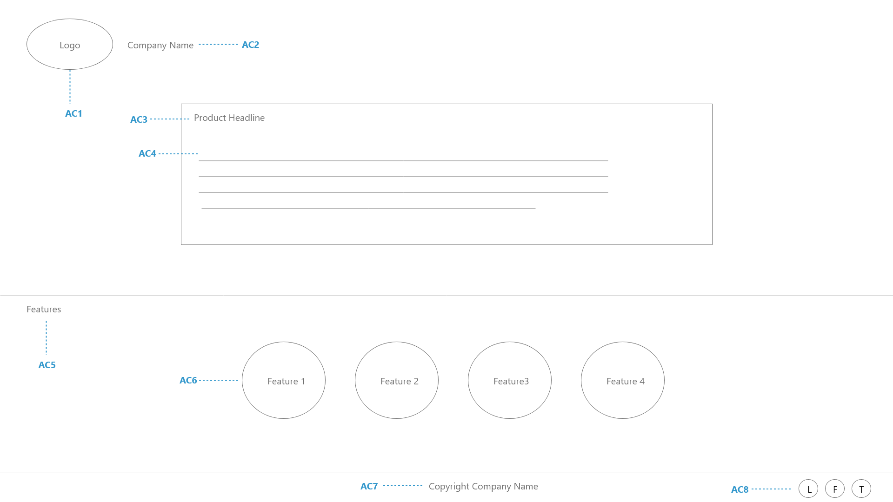

# Task CPT10: Create a simple static landing page
In this task we want to create the first page our customers will arrive at. The users will be able to read about our product and features. The task will involve creating a static page with product and features using React Framework. In subsequent tasks User registration and login will be added.

To get you started, the branch for this task already includes boilerplate code required for React. Please see the README file in the branch to get started

## **Wireframes & Media**

## **Acceptance Criteria**
Given I am a new potential customer
When I open the product landing page
### **AC1:** Then I can see product logo on the top left
The logo image will be on the top left corner. You can find the image in the "src" directory with the name logo.png. The container tag should have id attribute with value logo.

Please see this [link](https://create-react-app.dev/docs/adding-images-fonts-and-files) for information on how to load images in React

### **AC2:** And I can see the Company Name right next to the logo
Company Name should be Crypto Tracker. It should be wrapped in a Container tag which has an id attribute with value company_name.

## Task Workflow
The steps below will need to be repeated for every task
1. Check out the task Branch
	- SkillReactor platform will create a branch for the component you are working on when you initiate the task. Once resources are initialized you can see the branch name in the Details Tab. You can visit [this link](https://www.atlassian.com/git/tutorials/using-branches) to learn more about git branches.

	- To checkout the branch for this task, follow the steps below:
		1.  Copy the branch name from details tab
		2.  Navigate to your working directory (`crypto_tracker`)
		3.  Run `git fetch`
		4.  Run `git checkout COPIED_BRANCH_NAME`
	- ___Note:___ _You will have to do this whenever you start a new task that has a different branch to what you are currently on_
2. Implement the Requirements
	- You can now start implementing the requirements as defined by the Acceptance Criteria on this page. Some tasks can be completed from the terminal, but for most tasks you will want to open the working directory in your IDE.

	- Acceptance Criteria for each requirement can be found on this page in the Task overview. To view the specific details about a given Acceptance Criteria click into it and you will see a popup.
3. Push your code to the Remote Repository
	- Once you have implemented the solution and would like to submit it for verification, you will need to push it to the remote repository as per steps below.

		1. Navigate to your working directory (`crypto_tracker`)
		2.  Run `git add -A`. This will add all the files for [staging](https://www.atlassian.com/git/tutorials/saving-changes)
		3.  Run `git commit -m "MESSAGE"`. This will save all staged files to your local repository. (MESSAGE could be any text for e.g. "Implementation of AC1")
		4.  Run `git push`. This will upload all the changes in your local repository to the remote repository.

4. Submit your solution
	1. You can now run `node skillreactor/submit.js` to submit your solution for verification.
	2.  Once verification is complete, you can see the results on the platform. Every AC will indicate whether it passed or failed. If an AC failed, you can click on it to get more details.
	3.  If all the requirements are met you will be able to move to the next task.
