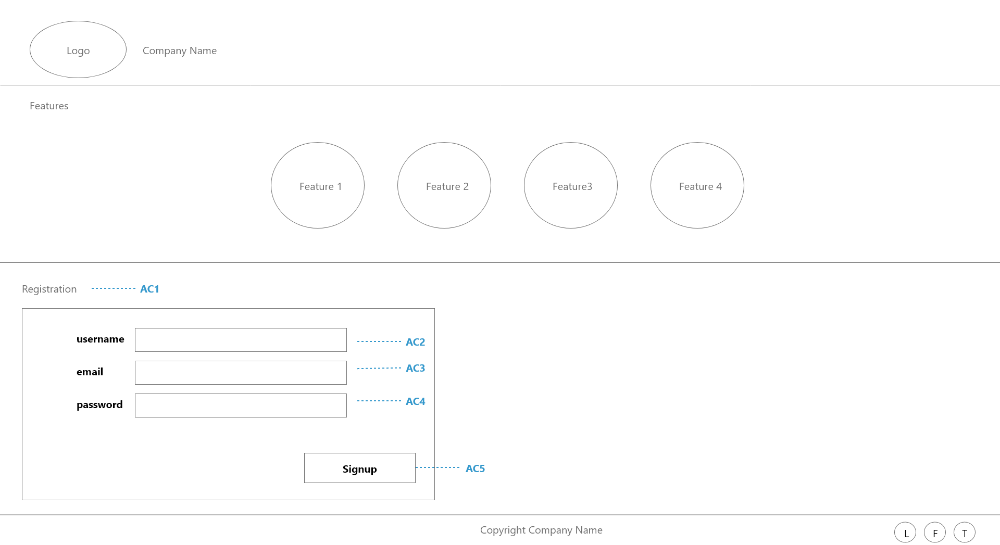

# Task CPT20: Add a registration form to the landing page
Previously we created a static landing page. In this task we will add a registration form to that landing page. The registration form will only be static and should not actually register the user. The functionality to register the user will be implemented in subsequent tasks.

## Wireframes & Media

## Acceptance Criteria
Given I am a new potential customer

When I open the product landing page

### **AC1:** Then I can see a registration section with a heading of "Registration"
The registration section should start with a heading saying `Registration`. The heading should have an **id attribute** with value of `registration_heading`.

### **AC2:** And the registration form should have a username field
The first field in the registration form should be the Username field. The field should have an **id attribute** with value `username_field`. The type of the field should be "text".
You will need to know how to work with Forms in React. You can find out about React forms on [this page](https://www.w3schools.com/react/react_forms.asp)

### **AC3:** And the registration form should have a email field
The second field in the registration form should be the Email field. The field should have an **id attribute** with value `email_field`. The type of the field should be "text".

### **AC4:** And the registration form should have a password field
The third field in the registration form should be the Password field. The field should have an **id attribute** with value `password_field`. This field should be of type password.

### **AC5:** And the registration form should have a signup button
The registration form should have a button saying "Signup" on the bottom right corner. The **id attribute** value for this button should be `signup_button`.

## Task Workflow
The steps below will need to be repeated for every task

### 1. Check out the task Branch
SkillReactor platform will create a branch for the component you are working on when you initiate the task. Once resources are initialized you can see the branch name in the Details Tab. You can visit [this link](https://www.atlassian.com/git/tutorials/using-branches) to learn more about git branches.

To checkout the branch for this task, follow the steps below:
1.  Copy the branch name from details tab
2.  Navigate to your working directory (`crypto_tracker`)
3.  Run `git fetch`
4.  Run `git checkout COPIED_BRANCH_NAME`

___Note:___ _You will have to do this whenever you start a new task that has a different branch to what you are currently on_

### 2. Implement the Requirements
You can now start implementing the requirements as defined by the Acceptance Criteria on this page. Some tasks can be completed from the terminal, but for most tasks you will want to open the working directory in your IDE.

Acceptance Criteria for each requirement can be found on this page in the Task overview. To view the specific details about a given Acceptance Criteria click into it and you will see a popup.
### 3. Push your code to the Remote Repository
Once you have implemented the solution and would like to submit it for verification, you will need to push it to the remote repository as per steps below.

1. Navigate to your working directory (`crypto_tracker`)
2.  Run `git add -A`. This will add all the files for [staging](https://www.atlassian.com/git/tutorials/saving-changes)
3.  Run `git commit -m "MESSAGE"`. This will save all staged files to your local repository. (MESSAGE could be any text for e.g. "Implementation of AC1")
4.  Run `git push`. This will upload all the changes in your local repository to the remote repository.

### 4. Submit your solution
1. You can now run `node skillreactor/submit.js` to submit your solution for verification.
2.  Once verification is complete, you can see the results on the platform. Every AC will indicate whether it passed or failed. If an AC failed, you can click on it to get more details.
3.  If all the requirements are met you will be able to move to the next task.

